# aws-alb-multi-az-architecture
Designed and implemented a highly available AWS web architecture leveraging an Application Load Balancer, multi-AZ VPC networking, and private EC2 instances with controlled outbound access via a NAT Gateway. The system enforces least-privilege networking, isolates public and private tiers, and validates fault tolerance through multi-Availability Zone deployment and failure testing. This project demonstrates production-style AWS networking fundamentals, security boundaries, and operational resilience.

---

## Step 1 – Region Selection

### Purpose

Select a single AWS region to ensure consistent resource placement and Availability Zone planning.

### What was configured

* AWS Region set to **Europe (London) – eu-west-2**
* This region provides multiple Availability Zones required for high availability

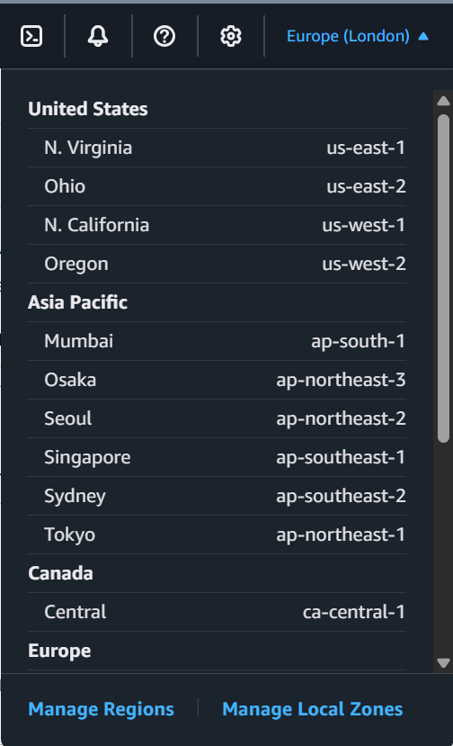

---

## Step 2 – VPC Creation

### Purpose

Create an isolated network boundary to host all application resources.

### What was configured

* Custom VPC created with CIDR block **10.0.0.0/16**
* DNS support enabled
* VPC named **alb-multi-az-vpc**

### Why this matters

* A `/16` CIDR provides sufficient address space for subnet segmentation
* Establishes full control over networking and routing

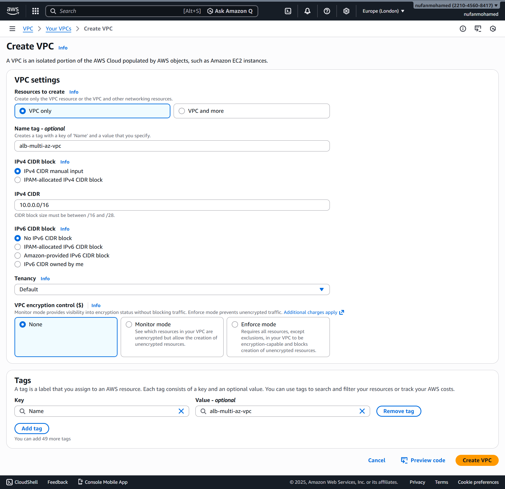

---

## Step 3 – Public Subnet Creation (Multi-AZ)

### Purpose

Create public subnets to host internet-facing components such as the Application Load Balancer and NAT Gateway.

### What was configured

* Public subnet in **AZ-a**: `10.0.1.0/24`
* Public subnet in **AZ-b**: `10.0.2.0/24`
* Auto-assign public IPv4 enabled

### Why this matters

* Enables high availability across Availability Zones
* Required for ALB and NAT Gateway placement

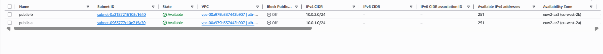

---

## Step 4 – Private Subnet Creation (Multi-AZ)

### Purpose

Create isolated subnets for application instances that should not be directly accessible from the internet.

### What was configured

* Private subnet in **AZ-a**: `10.0.11.0/24`
* Private subnet in **AZ-b**: `10.0.12.0/24`
* No public IP assignment

### Why this matters

* Enforces network isolation
* Reduces attack surface by preventing direct inbound internet access

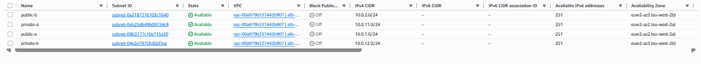

---

## Step 5 – Internet Gateway Attachment

### Purpose

Enable outbound and inbound internet connectivity for public subnets.

### What was configured

* Internet Gateway created and attached to the VPC

### Why this matters

* Required for public subnets to route traffic to and from the internet
* Enables ALB ingress and NAT Gateway egress

---

## Step 6 – Public Route Table Configuration

### Purpose

Allow public subnets to reach the internet via the Internet Gateway.

### What was configured

* Route table with:
  * `0.0.0.0/0 → Internet Gateway`
* Associated with both public subnets

### Why this matters

* Makes the subnets truly public
* Required for ALB accessibility

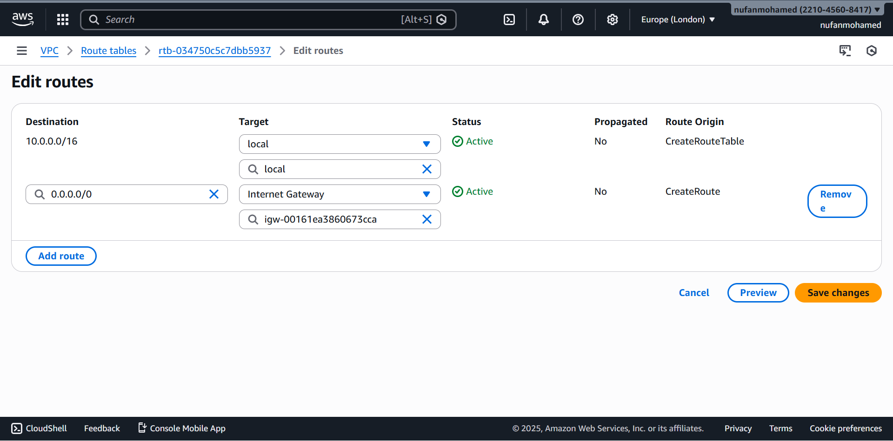

---

## Step 7 – Private Route Table Configuration

### Purpose

Enable private subnets to access the internet without exposing inbound access.

### What was configured

* Separate route table for private subnets
* Default local route only at this stage
* Later updated to route internet traffic via NAT Gateway

### Why this matters

* Maintains private subnet isolation
* Enables controlled outbound connectivity

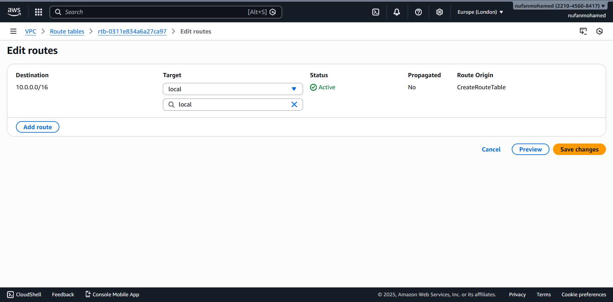

---

## Step 8 – Elastic IP Allocation

### Purpose

Provide a static public IP address for the NAT Gateway.

### What was configured

* Elastic IP allocated dynamically by AWS
* Later attached to the NAT Gateway

### Why this matters

* NAT Gateway requires an Elastic IP for outbound internet access
* Allows private instances to download updates securely

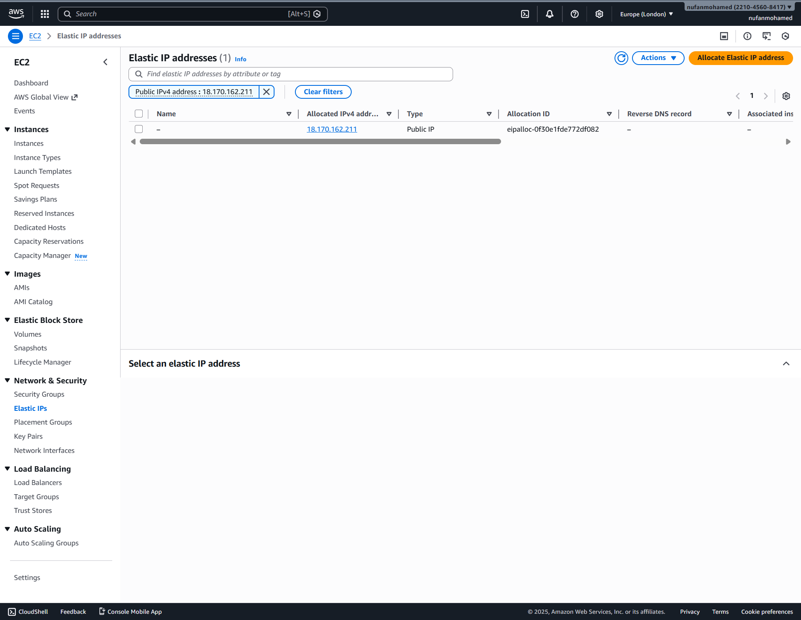

---

## Step 9 – NAT Gateway Creation

### Purpose

Allow EC2 instances in private subnets to access the internet for outbound traffic without exposing them publicly.

### What was configured

* NAT Gateway created in a public subnet
* Elastic IP associated with the NAT Gateway
* NAT Gateway deployed in a single Availability Zone

### Why this matters

* Enables private instances to install packages and receive updates
* Preserves inbound isolation while allowing outbound connectivity
* Follows AWS best practices for private subnet internet access

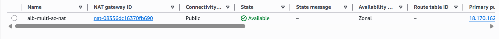

---

## Step 10 – Private Route Table Update (NAT Routing)

### Purpose

Route outbound internet traffic from private subnets through the NAT Gateway.

### What was configured

* Private route table updated with:
  * `0.0.0.0/0 → NAT Gateway`
* Route table associated with both private subnets

### Why this matters

* Prevents direct internet exposure
* Ensures all outbound traffic is controlled and auditable
* Completes the private subnet egress path

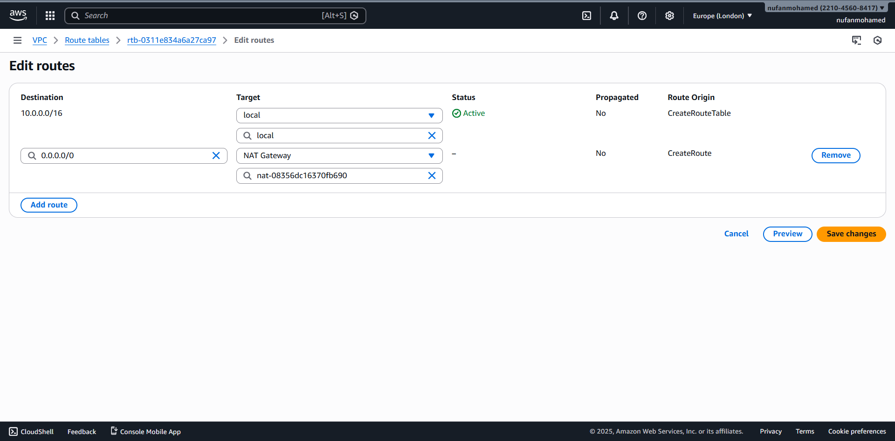

---

## Step 11 – Security Group for Application Load Balancer

### Purpose

Control inbound and outbound traffic for the internet-facing Application Load Balancer.

### What was configured

**Inbound**
* HTTP (port 80) from `0.0.0.0/0`

**Outbound**
* All traffic allowed

### Why this matters

* ALB must be publicly accessible to receive client requests
* Security group acts as the first layer of traffic control

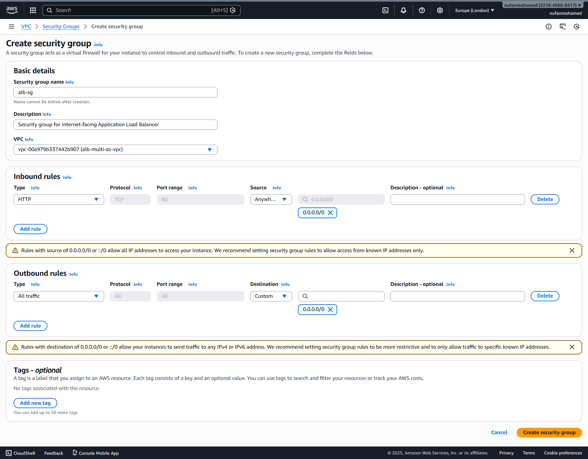

---

## Step 12 – Security Group for Private EC2 Instances

### Purpose

Restrict inbound access to EC2 instances so they can only receive traffic from the ALB.

### What was configured

**Inbound**
* HTTP (port 80) only from the ALB security group

**Outbound**
* All traffic allowed

### Why this matters

* Prevents direct internet access to EC2 instances
* Enforces identity-based access instead of IP-based rules
* Improves overall security posture

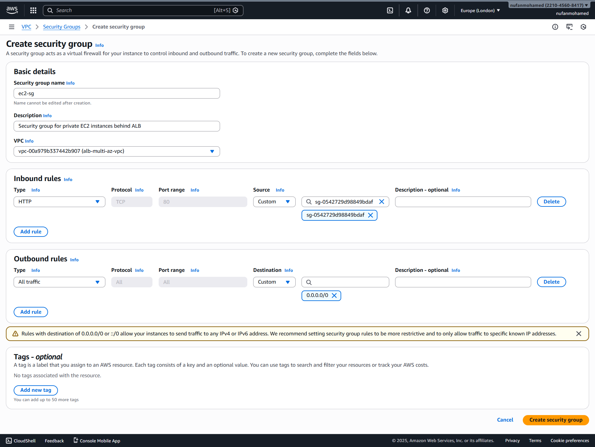

---

## Step 13 – EC2 Instance Deployment (Private Subnets)

### Purpose

Deploy application servers in isolated private subnets across multiple Availability Zones.

### What was configured

* Two EC2 instances launched:
  * One in **AZ-a**
  * One in **AZ-b**
* No public IP addresses assigned
* Apache web server installed using user data
* Each instance configured with a unique response message

### Why this matters

* Demonstrates high availability
* Enables load balancing validation
* Ensures the compute layer is not publicly exposed

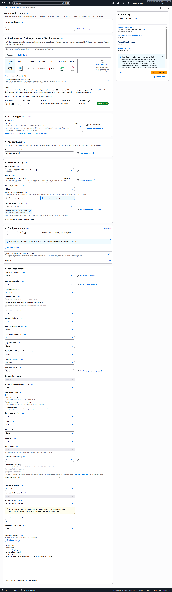

---

## Step 14 – Target Group Configuration

### Purpose

Group EC2 instances behind the Application Load Balancer for traffic routing and health monitoring.

### What was configured

* Target type: **Instance**
* Protocol: **HTTP**
* Port: **80**
* Health check path: `/`
* Both EC2 instances registered

### Why this matters

* Enables dynamic routing based on health checks
* Abstracts compute resources behind a single endpoint
* Supports automatic failover

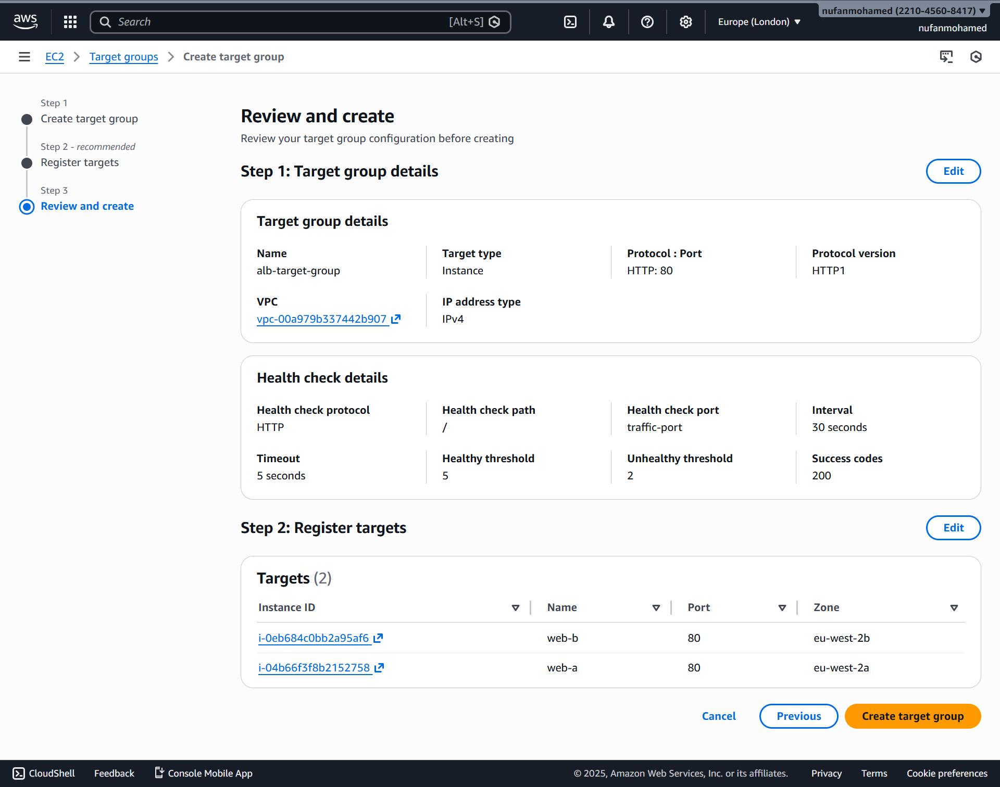

---

## Step 15 – Application Load Balancer Creation

### Purpose

Provide a single, highly available entry point for inbound web traffic.

### What was configured

* Internet-facing Application Load Balancer
* Deployed across both public subnets
* Listener on HTTP port 80
* Forwarding rules to the target group

### Why this matters

* Eliminates single points of failure
* Distributes traffic evenly across instances
* Enables health-based routing

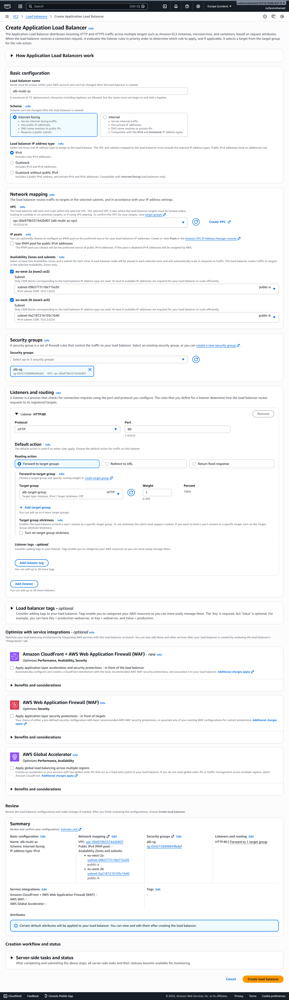

---

## Step 16 – Validation and Testing

### Purpose

Verify that load balancing and high availability are functioning correctly.

### What was validated

* Refreshing the ALB DNS endpoint alternates responses between EC2 instances
* Terminating one EC2 instance does not cause downtime
* Target group health checks update automatically

* [Final validation recording](./aws-alb-multi-az-architecture/screenshots/final-validation-recording.mp4)
* [Web server response demo](./aws-alb-multi-az-architecture/screenshots/web-server-responses.mp4)

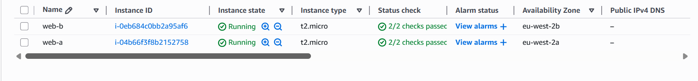
